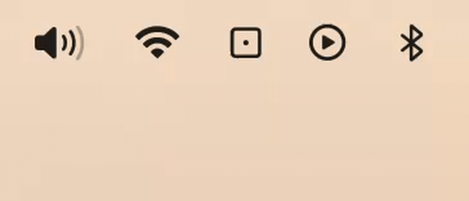

# Roll a Die (in your menu bar)



A lightweight, native macOS menu bar application built with Swift and AppKit. Click to roll a die, double-click to quit.

## Installation

1. Make sure your system is macOS 11.0 or newer.
2. Download and open `RollADie.dmg`.
3. Drag `RollADie.app` into your `/Applications` folder.
4. Launch `RollADie`.

## User Interactions

On app launch, a die icon in the menu bar is created (if it does not exist yet). A minimalistic preview window appears showing a large view of the current dice face and usage instructions. Closing this window removes the app from the dock keeping only menu bar application running.

Roll Dice (Single Click): Rolls the dice with a natural decelerating animation.

Open Actions (Double Click): Opens a context menu directly below the menu bar icon with About (shortcut Control+I) and Quit options.

## Structure of Repository

```text
roll-a-die/
├── RollADie.app/           # Fully compiled, stripped, and ready-to-run macOS app bundle
├── RollADie.dmg            # Drag-and-drop macOS installation disk image
├── main.swift              # App source code, UI built with Cocoa UI
├── build.sh                # Compiler script to build, strip, and archive the binary
├── AppIcon.png             # Master source image for the application icon
├── preview.gif             # Preview video
├── PRD.md                  # Product Requirements Document
├── LICENSE                 # Open source license (MIT with source attribution)
└── README.md               # Developer & deployment guide
```

## Building

First, verify that Xcode Command Line Tools is installed on your Mac (provides the `swiftc` compiler) by running `swiftc --version` in your Terminal.

To build the application manually, simply run the automated build script:
```bash
chmod +x build.sh
./build.sh
```

## Uninstallation

To uninstall Roll a Die:
1. Quit the application by double-clicking the menu bar icon and selecting Quit (or running `pkill RollADie` in Terminal).
2. Move `RollADie.app` from `/Applications` to the Trash.

*Note: Roll a Die leaves zero residual preference files or cache folders on your system.*

## Authors & License

By [chep0k](https://github.com/chep0k). Released under MIT License.
